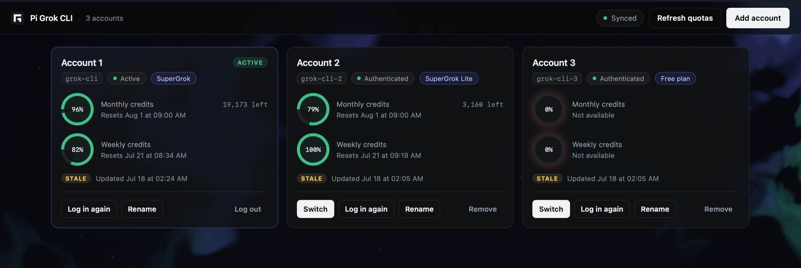

# pi-grok-cli

[](https://github.com/kenryu42/pi-grok-cli/actions/workflows/ci.yml)
[](https://www.npmjs.com/package/pi-grok-cli)
[](./LICENSE)

<div align="center">

[](./.github/assets/pi-grok-cli.png)

</div>

Use your X Premium or SuperGrok subscription in [pi](https://pi.dev/) with a clean, focused toolset.

- **OAuth login:** Sign in through a browser or device code with automatic token refresh.
- **Multiple accounts:** Manage accounts and quotas from the terminal or browser dashboard, and automatically continue with another account when quota runs out.
- **Usage tracking:** Check account limits, remaining credits, and reset times.
- **Image generation:** Generate images directly or let Grok use the `image_gen` tool.
- **Native image input:** Send images directly to supported Grok models, including Composer 2.5.

> Requires pi 0.80.9 or newer and an xAI/Grok account with access to the selected model. Availability varies by account, plan, region, and xAI rollout. The Grok Build executable is not required.
>
> This is an unofficial community integration. It does not bypass xAI access controls, quotas, or billing.

## Quick start

### 1. Install and start pi

```bash
pi install npm:pi-grok-cli
pi
```

Check `pi --version` if installation fails. Update an older installation with `pi update --self`.

### 2. Log in

Inside pi, run:

```text
/login
```

Choose **Grok CLI**, then select one of these methods:

- **Browser login (default):** Opens xAI authorization in your browser. If xAI shows a one-time code, paste it back into pi.
- **Device code login:** Displays a URL and short code for SSH, containers, and other headless environments.

### 3. Select a model

```text
/model grok-cli/grok-composer-2.5-fast
```

Composer 2.5 is the recommended starting point for agentic coding and supports native image input.

### 4. Verify account usage

```text
/grok-cli-usage
```

This fetches the current account allowance, usage, remaining credits, and reset time. Weekly usage is shown when xAI returns it.

## Manage multiple accounts

Open the browser dashboard to view accounts and quotas in one place:

```text
/grok-cli-accounts gui
```

Select **Add account** to optionally label the account and start browser login.

Prefer the terminal? Run `/grok-cli-accounts`, choose **＋ Add account**, and complete the browser or device-code login.

With at least two logged-in accounts, pi-grok-cli can continue an interrupted request with another account when the current account runs out of quota. Recently exhausted accounts are temporarily skipped, and rotation stops when no eligible account remains.

Only add accounts you own or are authorized to access.

Pi shows one **Grok CLI** entry in `/login` and one `grok-cli` provider in `/model`. It does not add provider names such as `grok-cli-2`.

Account selection is per session. The dashboard or `/grok-cli-accounts` sets the account for the current session, and the choice is stored in the session log so it is restored when the session is resumed or reopened. New sessions start with the most recently selected account and keep their own selection once changed. Requests always use the token captured at request start.

Pi and pi-grok-cli keep separate login state. Native `/logout` removes Pi's non-secret connection marker. It does not delete accounts from the dashboard. Run `/login` and choose **Grok CLI** to reconnect the saved accounts. To delete a saved account, use `/grok-cli-accounts`. Account 1 is permanent, but you can log it out.

## Manage installation

```bash
pi update npm:pi-grok-cli
pi remove npm:pi-grok-cli
```

## Models

Models are bundled rather than discovered live. Registered context limits may differ from the limits xAI enforces.

| Model ID | Registered context | Reasoning | Input |
| --- | ---: | --- | --- |
| `grok-composer-2.5-fast` | 200K | no | text + image |
| `grok-build` | 500K | yes | text + image |
| `grok-4.3` | 1M | yes | text + image |
| `grok-4.5` | 500K | yes | text + image |
| `grok-4.6` | 500K | yes | text + image |
| `grok-4.20-0309-reasoning` | 2M | yes | text + image |
| `grok-4.20-0309-non-reasoning` | 2M | no | text + image |
| `grok-4.20-multi-agent-0309` | 2M | yes | text + image |

## Media

### Grok Imagine image generation

Run `/grok-cli-imagine <prompt>` to generate and preview a JPEG, or let any active model call the `image_gen` tool. Images use the current session's selected Grok account and are saved under the current session unless you request another path.

`image_gen` is enabled by default across providers. Use `/grok-cli-imagine:tool [on|off|status]` to manage model access without disabling the direct command.

## Commands

| Command | Description |
| --- | --- |
| `/grok-cli-accounts [gui]` | Manage Grok accounts in the terminal, or add `gui` for the browser dashboard. |
| `/grok-cli-usage` | Fetch current quota, update its cache, and show cached data if refresh fails. |
| `/grok-cli-imagine <prompt>` | Generate and preview an image. Supports `--aspect`, `--out`, and `--resolution 1k`. |
| `/grok-cli-imagine:tool [on\|off\|status]` | Toggle, set, or report persistent model-callable `image_gen` availability. |

## Configuration

Extension-owned data is grouped under `~/.pi/grok-cli/`:

```text
~/.pi/grok-cli/
├── accounts.json
├── config.json
├── config.v2.backup.json
└── quota-cache.json
```

`accounts.json` stores account labels and OAuth credentials. It uses file mode `0600`. `config.json` stores non-account settings. `quota-cache.json` stores quota responses. `config.v2.backup.json` is an exact backup that is created only when the extension migrates an older multi-account configuration. Pi stores only a fixed, non-secret marker for the `grok-cli` provider.

When you update from a release that used `grok-cli-N` providers, the extension copies known OAuth credentials to `accounts.json` and rewrites global and project model settings to `grok-cli`. Run `/login` once and choose **Grok CLI** to install Pi's marker. The old alias credentials can remain in Pi's `/logout` list. Remove those old alias entries after you confirm that the new accounts work. Do not remove the main `Grok CLI` entry unless you want to disconnect it.

The extension does not replace saved session files because Pi can append to them from another process without a shared file lock. This prevents session data loss. When you resume an old session that selected `grok-cli-N`, Pi can show a model fallback warning. Select the required `grok-cli/<model>` once in that session.

### Common environment variables

| Variable | Default | Description |
| --- | --- | --- |
| `PI_GROK_CLI_MODELS` | all bundled models | Comma-separated model IDs to expose, in display order. Unknown IDs receive generic text-only metadata. |
| `GROK_CLI_OAUTH_TOKEN` | — | Use an external access token instead of `/login`. No automatic refresh. |

See [Advanced configuration](./CONFIGURATION.md) for OAuth, callback, endpoint, and Imagine overrides.

## Troubleshooting

| Problem | What to do |
| --- | --- |
| grok-cli is missing from `/model` | Confirm the package appears in `pi list`, run `/login`, choose **Grok CLI**, then restart pi or run `/reload`. |
| xAI shows a one-time code | Paste the code into pi to complete the active login. |
| Browser login does not redirect to pi | Paste the complete callback URL into pi when prompted. |
| The browser callback cannot start | Use device-code login or review the callback settings in [Advanced configuration](./CONFIGURATION.md). |
| Authentication returns HTTP 401 or 403 | Run `/login` again and confirm the account can access the selected model. Replace an expired `GROK_CLI_OAUTH_TOKEN` if using an external token. |
| A listed model is unavailable | Availability can differ by account or region, and the catalog is bundled rather than discovered live. Try another model or update the extension. |
| Account rotation does not start | Confirm at least two accounts are logged in. Rotation responds only to Grok Build's final balance-exhausted error, not authentication failures, rate limits, or similar messages. |
| A migrated account cannot send requests | Run `/login` once, choose **Grok CLI**, and restart pi if the model list does not update. |
| The dashboard says Pi is disconnected | Run `/login` and choose **Grok CLI**. Saved dashboard accounts remain available. |

## Security and data flow

Enabled tools run with your system permissions and can modify files or execute commands. Prompts, model context, tool data, and native image inputs are sent to the configured xAI endpoints.

See [SECURITY.md](./SECURITY.md) for trust boundaries and private vulnerability reporting. Never include tokens, authorization codes, callback URLs, prompts, or private project data in public issues.

## Support and contributing

Report bugs and feature requests through [GitHub Issues](https://github.com/kenryu42/pi-grok-cli/issues). Include the pi version, pi-grok-cli version, selected model, login method, and exact error message.

For local development:

```bash
bun install
pi -e .
bun run check
```

Pull requests should include tests for behavior changes and pass `bun run check`.

## License

[MIT](./LICENSE) © 2026 kenryu42
